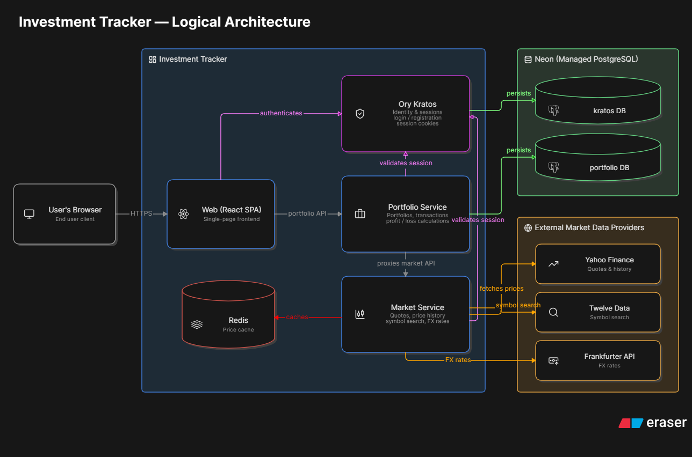

# Investment Tracker

Kişisel finans takibi için yazdığım bir web uygulaması. Başka platformlar üzerinden aldığım hisse, döviz ve altını burada kayıt altında tutuyorum: neyi kaçtan aldım, kaçtan sattım, şu an ne durumda, toplam bakiyeme nasıl yansıyor.

Aynı zamanda bir öğrenme projesi — mikroservis mimarisi, Docker, kimlik doğrulama ve CI/CD gibi konuları gerçek bir uygulama üzerinde denemek için kullanıyorum. O yüzden bazı yerler bilinçli olarak "üretim standardının" altında, bazı yerler ise bir kişisel projeye göre fazla detaylı.

## Ne yapıyor

**Varlık takibi:** Bir varlığı alırken adet, alış fiyatı, para birimi (TRY/USD) ve alım tarihi girilir. Aynı varlıktan tekrar alınca ortalama maliyet ağırlıklı olarak güncellenir. Satışta gerçekleşen kâr/zarar hesaplanıp kaydedilir. Güncel fiyatlar dış API'lerden çekilir; her varlık için alış fiyatı, güncel fiyat, maliyet, güncel değer ve kâr/zarar tabloda görünür.

**Piyasa sayfaları:** BIST 30 hisseleri için fiyat, günlük değişim, hacim ve 52 hafta bandı; altın (gram/çeyrek/yarım/tam/Cumhuriyet) ve döviz kurları için ayrı bir sayfa. Varlık detayında fiyat geçmişi grafiği gösteriliyor.

**Sembol arama:** Varlık eklerken BIST ve ABD borsalarındaki semboller isim veya kodla aranabiliyor.

**İşlem defteri:** Her alış ve satış arka planda tek bir transaction tablosuna yazılır. Varlık silinse bile işlem geçmişi kalır. Uygulamanın veri modeli bu tabloya dayanıyor — ileride analiz özellikleri bunun üzerine kurulacak.

**Diğer:** Türkçe/İngilizce arayüz, varlık dağılımı grafikleri.

## Mimari



İki backend servisi var:

- **portfolio-service** (.NET 9, EF Core): varlıklar, işlemler, dashboard hesapları. Veriyi Neon'daki PostgreSQL'de tutar.
- **market-service** (.NET 9): piyasa verisini üç kaynaktan toplar — fiyat ve fiyat geçmişi **Yahoo Finance**'ten, sembol araması **Twelve Data**'dan, döviz kurları **Frankfurter**'den. Sonuçları 5 dakikalığına Redis'e yazar; böylece ücretsiz API limitlerine takılmadan sık sık fiyat gösterilebiliyor.

Kimlik doğrulama **Ory Kratos** ile: cookie tabanlı session, her istekte servisler cookie'yi Kratos'a doğrulatır ve dönen kimlik ID'siyle kullanıcının kendi verisi filtrelenir. Kayıt/giriş akışları Kratos'un self-service flow'larıyla çalışır. Kratos da kimlik verisini Neon'daki ayrı bir veritabanında tutar.

Frontend React 19 + Vite, Tailwind CSS v4 ve shadcn/ui bileşenleriyle yazıldı. Sunucu verisi **TanStack React Query** ile yönetiliyor: fiyatlar ve portföy istekleri cache'lenir, sekmeler arası geçişte veri yeniden çekilmeden anında gösterilir ve arka planda tazelenir. Grafikler için Recharts ve Lightweight Charts kullanılıyor.

## Çalıştırma

Tüm servisler Docker Compose ile ayağa kalkar:

```bash
docker compose up --build -d
```

| Container | İmaj | Port |
|---|---|---|
| web | nginx (custom) | 80 |
| portfolio-service | .NET 9 (custom) | 5001 |
| market-service | .NET 9 (custom) | 5002 |
| kratos | oryd/kratos:v1.2.0 | 4433, 4434 |
| postgres | postgres:16-alpine | 5432 |
| redis | redis:alpine | 6379 |

Gerekli ortam değişkenleri (`.env`):

| Değişken | Açıklama |
|---|---|
| `DB_CONNECTION_STRING` | Portfolio verisinin tutulduğu Neon PostgreSQL bağlantısı |
| `KRATOS_DSN` | Kratos kimlik verisinin tutulduğu Neon PostgreSQL bağlantısı |
| `TWELVEDATA_API_KEY` | Twelve Data API anahtarı (sembol arama) |
