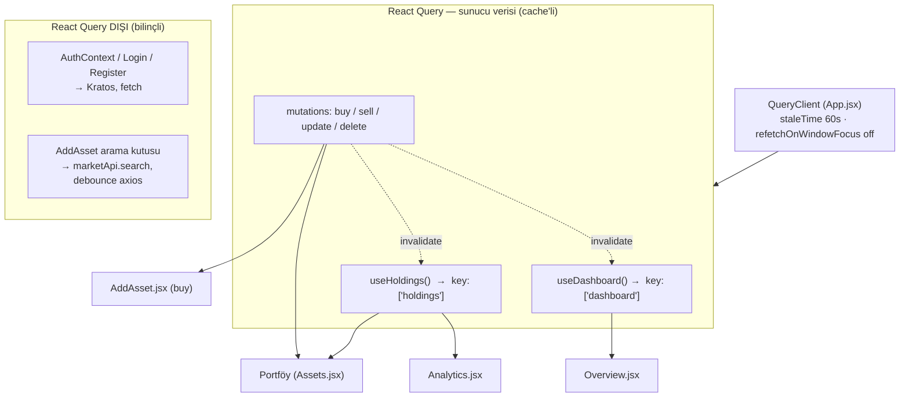

# Veri Çekme Mimarisi

Bu doküman uygulamanın veriyi nasıl çektiğini ve **React Query'nin tam olarak nerede/ne kadar** kullanıldığını gösterir.

> **Redux:** kullanılmıyor. State yönetimi = React Context (Auth, Language) + sunucu verisi için **TanStack React Query**.

---

## 1. Genel akış (görsel)

**Özet:** React Query yalnızca **portföy + dashboard** verisini ve **al-sat mutation'larını** yönetir. Auth (Kratos) ve canlı hisse araması bilinçli olarak dışında.

---

## 2. Nerede, hangi sorgu (yazılı + kod referansı)

### Merkez
| Dosya | İçerik |
|-------|--------|
| [`src/App.jsx`](src/App.jsx) | `QueryClientProvider` + `QueryClient` ayarı (`staleTime: 60_000`, `refetchOnWindowFocus: false`, `retry: 1`) |
| [`src/hooks/queries.js`](src/hooks/queries.js) | Tüm hook'lar burada: `useHoldings`, `useDashboard` + `useBuyAsset/useSellAsset/useUpdateAsset/useDeleteAsset`. Mutation'lar başarıda `['holdings']` ve `['dashboard']`'ı **invalidate** eder. |

### Sayfa bazında kullanım
| Sayfa | Kullanılan hook | Query key | Ne için |
|-------|-----------------|-----------|---------|
| [`Overview.jsx`](src/pages/Overview.jsx) | `useDashboard()` | `['dashboard']` | Net varlık + dağılım özeti |
| [`Assets.jsx`](src/pages/Assets.jsx) (Portföy) | `useHoldings()` + `useSellAsset` + `useUpdateAsset` + `useDeleteAsset` | `['holdings']` | Portföy listesi (3 tab tek fetch'ten filtrelenir) + sat/düzenle/sil |
| [`Analytics.jsx`](src/pages/Analytics.jsx) | `useHoldings()` | `['holdings']` | Tür dağılımı pie chart (aynı cache'ten, ekstra istek yok) |
| [`AddAsset.jsx`](src/pages/AddAsset.jsx) | `useBuyAsset()` + `usePriceOnDate()` | — (mutation) · `['price-on-date', symbol, assetType, date]` (query) | Varlık alımı; sonrası otomatik tazeleme · Tarihe göre fiyat otomatik doldurma |

**Önemli:** `Assets` ve `Analytics` aynı `['holdings']` key'ini paylaşır → **tek istek**, ikisi de cache'ten beslenir (dedup).

### Piyasa sorguları (ek)

| Hook | Query key | `staleTime` | Davranış |
|------|-----------|-------------|----------|
| `usePriceHistory()` | `['price-history', symbol, assetType, range]` | 5 dk | Grafik veri serisi |
| `usePriceOnDate()` | `['price-on-date', symbol, assetType, date]` | 1 saat | Tarihe göre tek gün kapanışı |
| `useSymbolSearch()` | `['symbol-search', q]` | 1 saat | BIST evreninde sembol arama |
| `useMarketOverview()` | `['market-overview']` | 5 dk | BIST 30 + endeks + döviz/altın |

**`usePriceOnDate` özellikleri:**
- Sorgu yalnızca `symbol`, `assetType`, `date` hepsi hazırsa çalışır (`enabled` koşulu).
- `retry: false` — amaçlı. Fiyat çekilemezse form manuel giriş moduna sessizce düşer; tekrar denemek sadece gereksiz gecikme yaratırdı.
- Backend cache (redis): **geçmiş gün** 30 gün (kapanmış gün bir daha değişmez), **bugün** 5 dk (anlık fiyat volatilliğine saygı).
- Uç nokta: `GET /api/market/price-on/{symbol}?assetType=Stock&date=2026-06-16` — portfolio-service aracılığıyla, market-service tarafından sunuluyor.

---

## 3. React Query DIŞINDA kalanlar (bilinçli)

| Yer | Yöntem | Neden RQ değil |
|-----|--------|----------------|
| [`AuthContext.jsx`](src/contexts/AuthContext.jsx) | `fetch` (Kratos `whoami`) | Oturum kontrolü; auth akışının parçası |
| [`Login.jsx`](src/pages/Login.jsx) / [`Register.jsx`](src/pages/Register.jsx) | `fetch` (Kratos self-service flow) | Tek seferlik akış, cache anlamsız |
| [`AddAsset.jsx`](src/pages/AddAsset.jsx) arama | `marketApi.search` (debounce'lu axios, `useEffect`) | Canlı yazdıkça arama; kısa ömürlü, cache gerekmez |

---

## 4. Ne kadarını kullanıyoruz? (kapsam)

- **Sorgular (queries):** 2 adet — `['holdings']`, `['dashboard']`.
- **Mutation:** 4 adet — buy / sell / update / delete (hepsi otomatik invalidation'lı).
- **Kapsanan sayfa:** 4 (Overview, Portföy, Analytics, AddAsset).
- **Kapsanmayan:** auth (3 dosya) + canlı arama — bilinçli dışarıda.

Yani React Query "her yerde" değil; sadece **cache'ten fayda gören sunucu verisinde** (portföy/dashboard). Kısa ömürlü/akış verisi (auth, arama) sade `fetch`/axios ile kalıyor.

---

## 5. Kazanımlar

- Tab geçişi ve sayfa gezinmesi: cache'ten **anında**, arkada sessiz yenileme (stale-while-revalidate).
- Aynı veriyi isteyen sayfalar **tek istek** (dedup).
- Al-sat sonrası liste **otomatik** tazelenir (elle refetch yok).
- Gelecek modüller (Altın, BIST30, Haber): her biri kendi key'i + `staleTime` → aynı akıcılık, fetch yağmuru yok.
