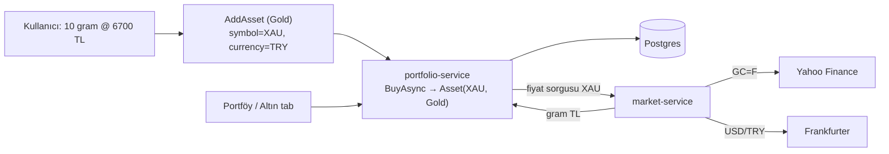

# Altın Modülü

Altın, portföyde **gram bazlı** bir varlık türüdür. Kullanıcı "X gram, gram başına Y TL" olarak alır; güncel fiyat Yahoo'dan çekilip gram TL'ye çevrilir, K/Z hesaplanır.

---

## 1. Temel kararlar

- **Varlık türü:** `AssetType.Gold` (enum'a eklendi). DB'de string saklandığı için **migration gerekmedi**.
- **Sembol:** sabit `XAU` (kullanıcı arama yapmaz, otomatik atanır).
- **Birim:** **gram** (Türk kullanıcı gram düşünür). Miktar = gram, fiyat = **gram başına TL**.
- **Para birimi:** her zaman **TRY** (arayüzde kilitli).
- **Fiyat kaynağı:** Yahoo **`GC=F`** (altın vadeli, ~spot). `XAUUSD=X` denendi ama Yahoo'da veri dönmüyordu; `GC=F` çalışıyor.

---

## 2. Fiyat hesabı

`GC=F` USD/**ons** döndürür. Gram TL'ye çeviri:

```
gram_TL = (GC=F_fiyat / 31.1034768) × USD_TRY
```

- `31.1034768` = 1 troy ons = kaç gram.
- `USD_TRY` Frankfurter'dan.
- Örnek: 4407.5 USD/ons × 47.755 / 31.1035 ≈ **6.767 TL/gram**.

> Not: `GC=F` vadeli (front-month), spot'a çok yakın. Türkiye'deki perakende "gram altın" küçük bir işçilik/prim içerir; bu hesap **spot** gram değeridir.

---

## 3. Veri akışı



- Al: `AddAsset` → `/api/assets/buy` → `AssetService.BuyAsync` → XAU pozisyonu (tekil, ortalama maliyet).
- Fiyat: Portföy açılınca `/api/assets` → `market-service /prices?symbols=XAU` → `GetPriceAsync("XAU")` → **Gold** yolu → Yahoo `GC=F` + Frankfurter → gram TL.

---

## 4. Kod referansları

### Backend
| Dosya | Değişiklik |
|-------|-----------|
| [`portfolio-service/Models/AssetType.cs`](portfolio-service/Models/AssetType.cs) | Enum'a `Gold` eklendi |
| [`market-service/Services/MarketService.cs`](market-service/Services/MarketService.cs) | `GoldSymbol="XAU"`, `GramsPerOunce`, `ResolveAssetType` → `"Gold"`, `FetchGoldAsync` (GC=F → gram TL) |

`XAU` para birimi setinde değil, hisse de değil → `ResolveAssetType` onu `"Gold"` olarak yönlendirir; `FetchGoldAsync` Yahoo `GC=F`'i çekip gram TL üretir. Sonuç 5 dk Redis cache'lenir (`gold:XAU`).

### Frontend
| Dosya | Değişiklik |
|-------|-----------|
| [`web/src/pages/AddAsset.jsx`](web/src/pages/AddAsset.jsx) | `assetTypes`'a `Gold`; seçilince `symbol=XAU`, `currency=TRY` kilitli, miktar **Gram**, fiyat **Gram Fiyatı** |
| [`web/src/pages/Assets.jsx`](web/src/pages/Assets.jsx) | **Altın** tab'ı (placeholder kaldırıldı) — gold holdingleri normal tabloda |
| [`web/src/contexts/LanguageContext.jsx`](web/src/contexts/LanguageContext.jsx) | `assets.gold`, `assets.goldGram`, `assets.grams`, `assets.pricePerGram` (TR+EN) |

---

## 5. Sınırlar / gelecekte

- Altın satırı **detay drawer'ı açmaz** (drawer hisseye özel: TradingView BIST/US). İstenirse altın için ayrı bir grafik eklenebilir (`TVC:GOLD` / `OANDA:XAUUSD`).
- Şu an **spot** gram; perakende prim yok.
- Ayrı bir "Altın merkezi" sayfası (ons + gram + haber/yorum) ileride planlı — bu modül portföy tarafını karşılıyor.

---

## 6. İlgili

- Piyasa verisi mimarisi (Yahoo/Twelve/Frankfurter ayrımı): proje hafızası + kod.
- Veri çekme (React Query): [`DATA-FETCHING.md`](../10-standards/DATA-FETCHING.md).
- Tasarım sistemi: [`DESIGN.md`](../10-standards/DESIGN.md).
